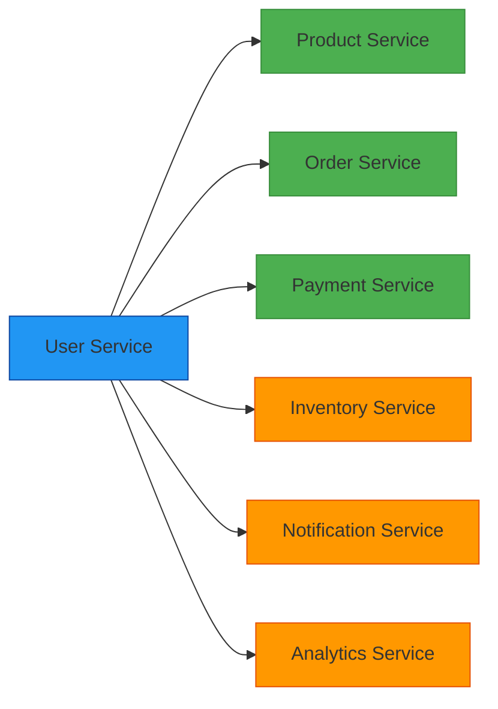
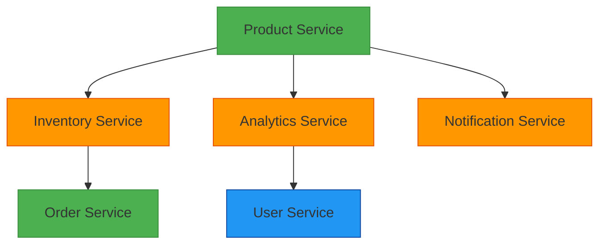
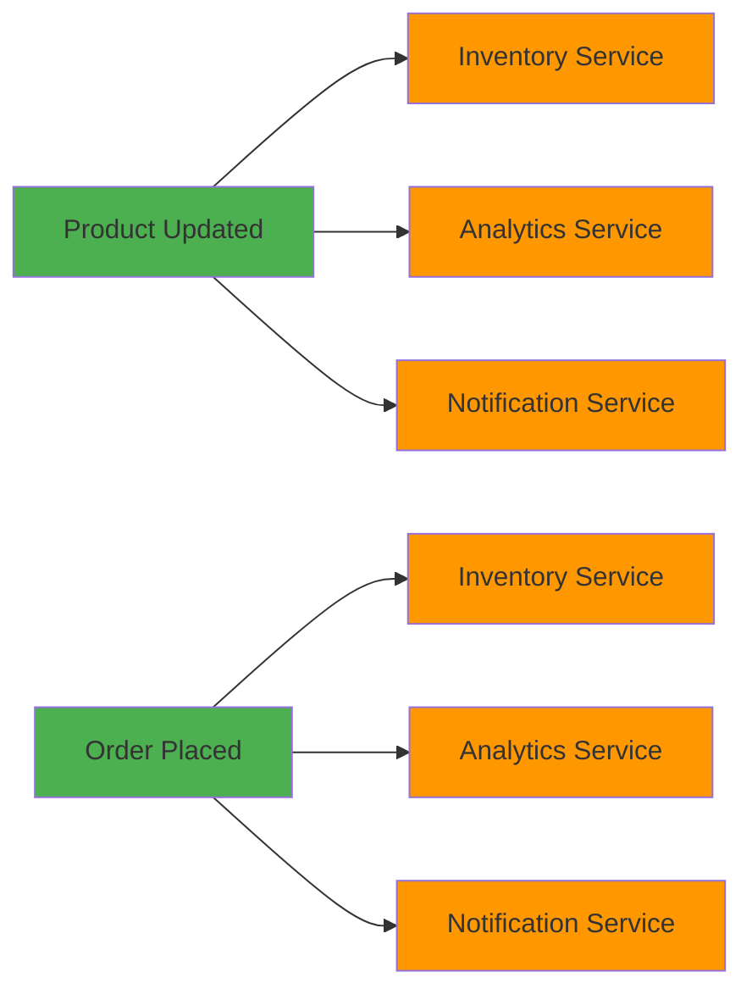

# Service Interactions in MyShop Microservices

## Overview
This document describes how the various microservices in the MyShop platform interact with each other to provide a cohesive e-commerce experience.

## Service Interaction Patterns

### 1. User Service Interactions
The User Service is the foundation that other services depend on for authentication and user data.



### 2. Order Flow Interactions
The order flow involves multiple services working together to process a customer's purchase.

```mermaid
sequenceDiagram
    participant Customer
    participant APIGateway
    participant UserService
    participant ProductService
    participant OrderService
    participant PaymentService
    participant InventoryService
    participant NotificationService

    Customer->>APIGateway: Place Order
    APIGateway->>UserService: Validate User
    UserService-->>APIGateway: User Validated
    APIGateway->>ProductService: Check Product Availability
    ProductService-->>APIGateway: Product Details
    APIGateway->>OrderService: Create Order
    OrderService->>InventoryService: Reserve Inventory
    InventoryService-->>OrderService: Inventory Reserved
    OrderService-->>APIGateway: Order Created
    APIGateway->>PaymentService: Process Payment
    PaymentService-->>APIGateway: Payment Processed
    APIGateway->>InventoryService: Confirm Inventory
    InventoryService->>NotificationService: Send Order Confirmation
    NotificationService-->>Customer: Order Confirmation Email
    APIGateway-->>Customer: Order Confirmation

    style UserService fill:#2196F3,stroke:#0D47A1
    style ProductService fill:#4CAF50,stroke:#388E3C
    style OrderService fill:#4CAF50,stroke:#388E3C
    style PaymentService fill:#4CAF50,stroke:#388E3C
    style InventoryService fill:#FF9800,stroke:#E65100
    style NotificationService fill:#FF9800,stroke:#E65100
```

### 3. Product Management Interactions
Product management involves coordination between several services to maintain product information.



## Cross-Service Data Flow

### Order Processing Flow
1. **Customer places order** → API Gateway
2. **User validation** → User Service
3. **Product validation** → Product Service
4. **Order creation** → Order Service
5. **Inventory reservation** → Inventory Service
6. **Payment processing** → Payment Service
7. **Inventory confirmation** → Inventory Service
8. **Notification dispatch** → Notification Service
9. **Analytics tracking** → Analytics Service

### Product Update Flow
1. **Admin updates product** → Product Service
2. **Inventory sync** → Inventory Service
3. **Analytics update** → Analytics Service
4. **Notification to interested users** → Notification Service
5. **Search index update** → Elasticsearch

## API Gateway Routing

The API Gateway routes requests to appropriate services based on URL prefixes:

| URL Prefix | Target Service | Function |
|------------|----------------|----------|
| `/api/users` | User Service | User management |
| `/api/products` | Product Service | Product catalog |
| `/api/orders` | Order Service | Order processing |
| `/api/payments` | Payment Service | Payment handling |
| `/api/inventory` | Inventory Service | Stock management |
| `/api/notifications` | Notification Service | Messaging |
| `/api/analytics` | Analytics Service | Business intelligence |

## Data Consistency Patterns

### 1. Saga Pattern for Order Processing
For distributed transactions like order processing, we implement the Saga pattern:


If any step fails, compensating transactions are executed in reverse order.

### 2. Event-Driven Updates
Services communicate changes through events:



## Security Considerations

### Authentication Flow
1. **User authenticates** → User Service
2. **JWT token issued** → Returned to client
3. **Token included in requests** → All subsequent API calls
4. **Token validation** → Each service validates JWT

### Authorization
Each service implements role-based access control:
- User Service manages roles and permissions
- Other services validate permissions based on JWT claims

## Monitoring and Observability

### Health Checks
Each service provides:
- `/health/` endpoint for service status
- Database connectivity checks
- External service dependency checks

### Logging
All services log:
- Request/response information
- Error conditions
- Performance metrics
- Business events

### Metrics Collection
Analytics Service collects metrics from:
- User Service (registrations, logins)
- Product Service (views, searches)
- Order Service (orders, revenue)
- Payment Service (transactions)
- Inventory Service (stock levels)

## Error Handling

### Service Failures
- API Gateway handles service unavailability
- Circuit breaker pattern for external dependencies
- Graceful degradation of non-critical features

### Data Consistency
- Idempotent operations where possible
- Retry mechanisms for transient failures
- Dead letter queues for persistent failures

## Performance Optimization

### Caching Strategy
- Redis used for session management (User Service)
- Product catalog caching (Product Service)
- Frequently accessed data caching (all services)

### Database Optimization
- Connection pooling per service
- Read replicas for reporting (Analytics Service)
- Indexing strategies per service requirements

This comprehensive interaction model ensures that the MyShop microservices work together seamlessly to provide a robust, scalable e-commerce platform.