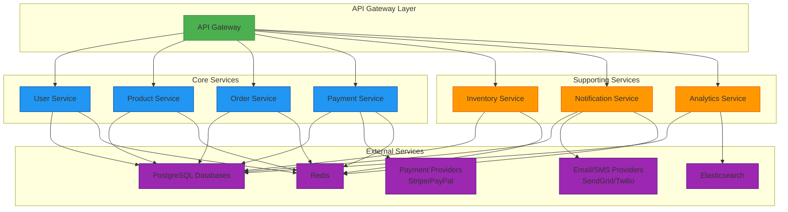
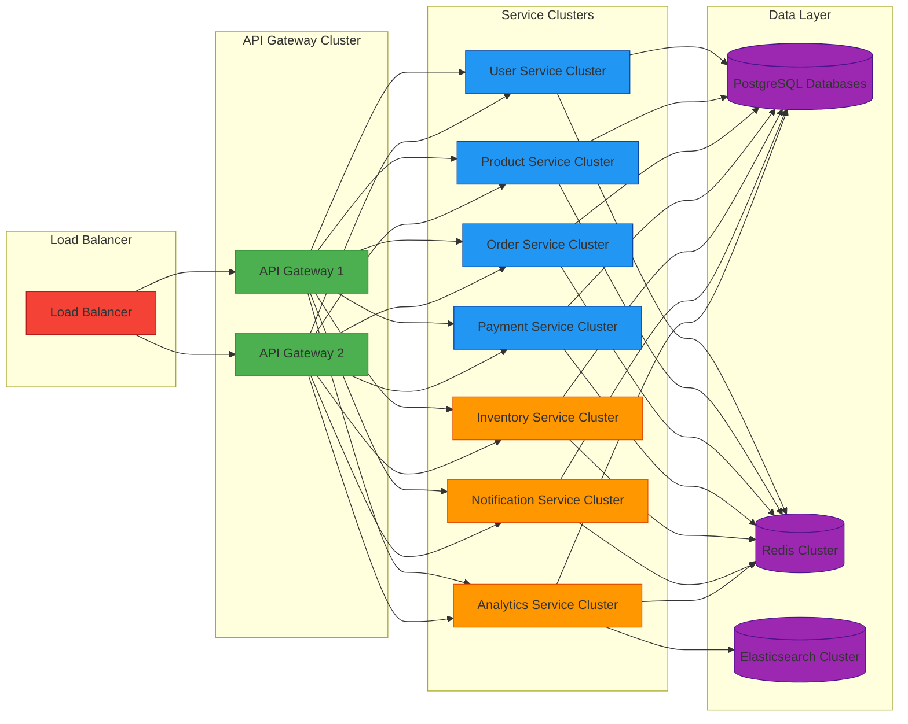

# Complete Microservices Architecture

## Overview
This document provides a comprehensive overview of the complete microservices architecture for the MyShop e-commerce platform.

## Services Architecture Diagram

## Service Details

### 1. User Service
**Responsibilities:**
- User authentication and authorization
- User profile management
- Role-based access control

**Technologies:**
- Django REST Framework
- JWT for authentication
- PostgreSQL for user data
- Redis for session management

### 2. Product Service
**Responsibilities:**
- Product catalog management
- Product search and filtering
- Product images and media

**Technologies:**
- Django REST Framework
- Elasticsearch for search
- AWS S3 for media storage

### 3. Order Service
**Responsibilities:**
- Order creation and management
- Order status tracking
- Shopping cart functionality

**Technologies:**
- Django REST Framework
- Redis for session management
- PostgreSQL for order data

### 4. Payment Service
**Responsibilities:**
- Payment processing
- Payment gateway integration (Stripe, PayPal)
- Transaction management

**Technologies:**
- Django REST Framework
- Stripe API
- PayPal API
- PostgreSQL for transaction data

### 5. Inventory Service
**Responsibilities:**
- Stock management
- Inventory tracking
- Low stock alerts

**Technologies:**
- Django REST Framework
- PostgreSQL for inventory data
- Redis for caching

### 6. Notification Service
**Responsibilities:**
- Email notifications
- SMS notifications
- Push notifications

**Technologies:**
- Django REST Framework
- Celery for asynchronous tasks
- Redis for task queue
- SendGrid/Twilio for delivery

### 7. Analytics Service
**Responsibilities:**
- User behavior tracking
- Sales analytics
- Reporting

**Technologies:**
- Django REST Framework
- Elasticsearch for analytics data
- PostgreSQL for metadata
- Pandas/Numpy for data processing

## Communication Patterns

### Synchronous Communication
- REST APIs for direct service-to-service communication
- API Gateway for centralized request routing

### Asynchronous Communication
- Message queues (Redis) for event-driven communication
- Event sourcing for audit trails

## Data Management

### Database per Service
Each service has its own database to ensure loose coupling:
- PostgreSQL for most services
- Elasticsearch for search and analytics
- Redis for caching and session management

### Data Consistency
- Saga pattern for distributed transactions
- Eventual consistency for non-critical operations

## Deployment Architecture

## Benefits of This Architecture

1. **Scalability**: Each service can be scaled independently based on demand
2. **Maintainability**: Smaller, focused codebases are easier to maintain
3. **Technology Flexibility**: Different services can use different technologies
4. **Fault Isolation**: Issues in one service don't affect others
5. **Team Autonomy**: Different teams can work on different services
6. **Continuous Deployment**: Services can be deployed independently

## Implementation Progress

✅ User Service - Complete
✅ Product Service - Complete
✅ Order Service - Complete
✅ Payment Service - Complete
✅ Inventory Service - Complete
✅ Notification Service - Complete
✅ Analytics Service - Complete

## Next Steps

1. Implement API Gateway
2. Set up monitoring and logging
3. Configure CI/CD pipelines
4. Deploy to staging environment
5. Performance testing
6. Security auditing